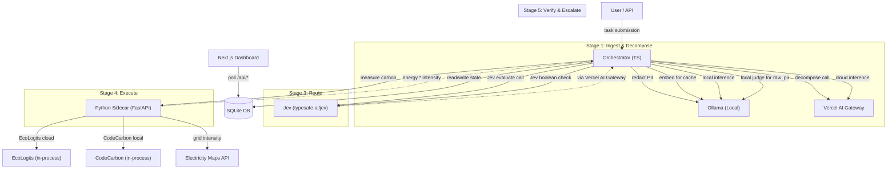

# ARCHITECTURE.md — Component Design & Data Flow

---

## Components

| Component | Tech | Responsibility |
|---|---|---|
| **Orchestrator** | Node.js + TypeScript | Pipeline controller: decompose → route → execute → verify → calibrate |
| **Python Sidecar** | FastAPI | EcoLogits (cloud carbon) + CodeCarbon (local energy) + Electricity Maps proxy |
| **Ollama** | Local process | Local LLM inference (llama3, mistral, etc.) + local embeddings (nomic-embed-text) |
| **Vercel AI Gateway** | External SaaS | Cloud LLM routing + Jev (`typesafe-ai/jev`) evaluation calls |
| **SQLite** | File (`db.sqlite`) | All state: tasks, subtasks, models registry, baseline runs, grid cache |
| **Next.js Dashboard** | Next.js + Recharts | Live DAG canvas, route inspector, budget bars, comparison chart |

---

## Data Flow



---

## Privacy Boundary

```
┌─────────────────────────────────────────────────────┐
│                  LOCAL MACHINE                       │
│  ┌─────────┐  ┌──────────┐  ┌──────────────────┐   │
│  │ raw doc │  │  Ollama  │  │ Python Sidecar   │   │
│  │  + PII  │  │(inference│  │(EcoLogits,       │   │
│  └────┬────┘  │ embed)   │  │ CodeCarbon,      │   │
│       │       └──────────┘  │ ElecMaps proxy)  │   │
│  ┌────▼──────────────┐      └──────────────────┘   │
│  │  Redaction Layer  │                              │
│  │  (Presidio/spaCy) │                              │
│  └────┬──────────────┘                              │
│       │ redacted_doc + placeholder map              │
└───────┼─────────────────────────────────────────────┘
        │ (only metadata/redacted text crosses boundary)
        ▼
   ☁️ Cloud (Vercel AI Gateway, Jev)
   → receives: subtask description (PII-free), type, token_count, sensitivity label
   → NEVER receives: raw document text for raw_pii subtasks
```

**What MAY reach cloud:**
- Subtask type, description (generated from outline only), token count, sensitivity label
- Redacted text for `redacted_ok` subtasks
- Aggregated metrics for baseline comparison

**What NEVER reaches cloud:**
- Raw document body for `pii` tasks
- PII entity values (names, dates, company details)
- The placeholder mapping table

---

## Carbon Computation Rule (the ONE rule, stated once)

```
if candidate.location == "local":
    carbon = sidecar.measure_local(energy_kwh=CodeCarbon.energy) * ElecMaps.live_intensity(zone)

if candidate.location == "cloud":
    carbon = EcoLogits.impacts.gwp.mean   # as-is, no zone lookup, no multiplication
```

**Never** apply `energy × grid_intensity` to a cloud candidate. EcoLogits already models datacenter carbon internally.

---

## Score-Time vs. Actual Carbon

| | Score-time (predict) | Actual (post-execution) |
|---|---|---|
| **Cloud** | `cloud_carbon_per_1k × predicted_tokens / 1000` | EcoLogits output (via sidecar) |
| **Local** | `energy_per_1k × predicted_tokens / 1000 × live_intensity` | CodeCarbon × live_intensity (via sidecar) |

---

## Similarity Cache

- **Key:** cosine similarity ≥ 0.92 AND token count within ±20%
- **Cache hit:** skips Jev call, still re-runs constraint check + re-fetches live grid intensity
- **Embeddings:** `text-embedding-3-small` for public tasks; `nomic-embed-text` (Ollama) for PII tasks
- **Storage:** embedding BLOB in `subtasks` table; in-memory cosine scan (fine under ~1000 entries)

---

## Config Location

All tunable values live in `config/`:

```
config/
  registry.json        — model registry (models table seed)
  weights.json         — default scoring weights
  bounds.json          — fixed normalization bounds (output of calibrate_bounds)
  tier-floors.json     — complexity → accuracy floor mapping
  token-defaults.json  — per-type predicted output token defaults
  zones.json           — local grid zone config (e.g. "IN-KA" for Bengaluru)
```
